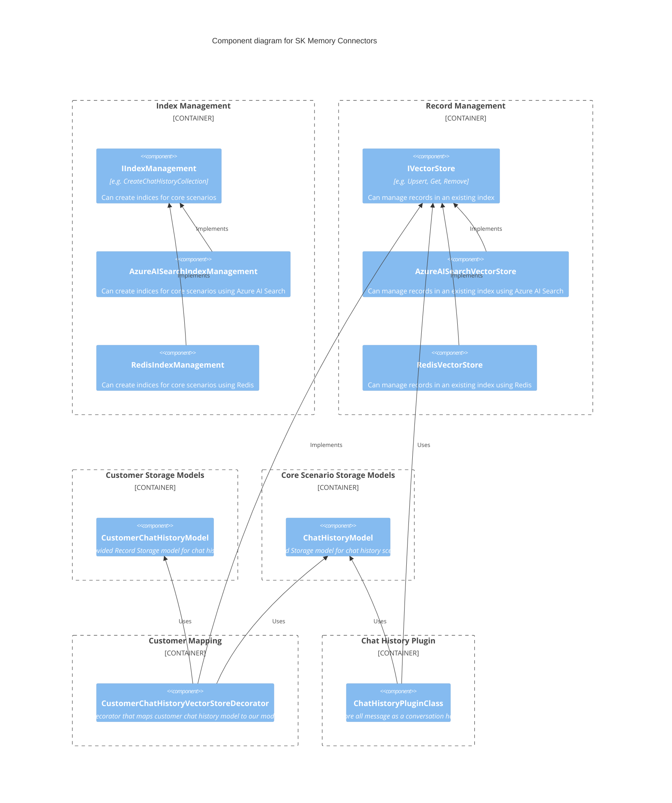

### Collection/Index management

Schema Comparison
|Feature|Azure AI Search|Weaviate|Redis|
|-|-|-|-|
|Object Properties||||
|Collection Properties||||
|Multiple Vectors Per Record||||
|Vector Algorithm config per Vector Field||||

- {title of option 1}
- {title of option 2}
- {title of option 3}
- … <!-- numbers of options can vary -->

#### Decision Outcome

Chosen option: "{title of option 1}", because
{justification. e.g., only option, which meets k.o. criterion decision driver | which resolves force {force} | … | comes out best (see below)}.

<!-- This is an optional element. Feel free to remove. -->

#### Consequences

- Good, because {positive consequence, e.g., improvement of one or more desired qualities, …}
- Bad, because {negative consequence, e.g., compromising one or more desired qualities, …}
- … <!-- numbers of consequences can vary -->

<!-- This is an optional element. Feel free to remove. -->

#### Validation

{describe how the implementation of/compliance with the ADR is validated. E.g., by a review or an ArchUnit test}

<!-- This is an optional element. Feel free to remove. -->

#### Pros and Cons of the Options

##### {title of option 1}

<!-- This is an optional element. Feel free to remove. -->

{example | description | pointer to more information | …}

- Good, because {argument a}
- Good, because {argument b}
<!-- use "neutral" if the given argument weights neither for good nor bad -->
- Neutral, because {argument c}
- Bad, because {argument d}
- … <!-- numbers of pros and cons can vary -->

##### {title of other option}

{example | description | pointer to more information | …}

- Good, because {argument a}
- Good, because {argument b}
- Neutral, because {argument c}
- Bad, because {argument d}
- …

<!-- This is an optional element. Feel free to remove. -->
