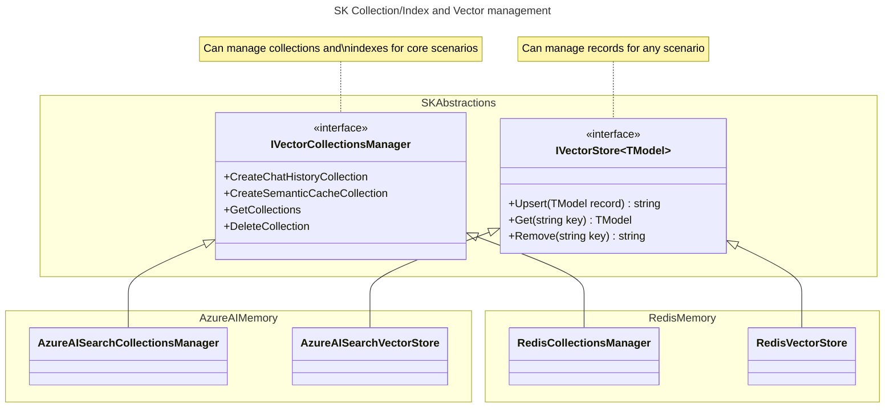

---
# These are optional elements. Feel free to remove any of them.
status: proposed
contact: westey-m
date: 2024-05-01
deciders: sergeymenshykh, markwallace, rbarreto, dmytrostruk, westey-m
consulted: 
informed: 
---

# Updated Memory Connector Design

Open Questions:
- How do we change the key of a record for azure search before writing without updating the passed in model.
  - This should be done in a decorator, and not in the main class.  If someone really wants this, they can layer it on top, and there can be multiple solutions, e.g. changed passed in model, clone using serialization.

## Context and Problem Statement

Semantic Kernel has a collection of connectors to popular Vector databases e.g. Azure AI Search, Chroma, Milvus, ...
Each Memory connector implements a memory abstraction defined by Semantic Kernel and allows developers to easily intergrate Vector databases into their applications.
The current abstractions are experimental and the purpose of this ADR is to progress the design of the abstractions so that they can graduate to non experimental status.

### Problems with current design

1. The `IMemoryStore` interface has three responsibilities with different cardinalities and levels of significance to Semantic Kernel.
2. The `IMemoryStore` interface only supports a fixed schema for data storage, retrieval and search, which limits its usability by customers with existing data sets.
2. The `IMemoryStore` implementations are opinionated around key encoding / decoding and collection name sanitization, which limits its usability by customers with existing data sets.

Responsibilities:

|Functional Area|Cardinality|Significance to Semantic Kernel|Avaialble alternatives|
|-|-|-|-|
|Collection/Index management|An implementation per store type and model|Only indirectly useful, when building a store|SDKs for each individual memory store|
|Data Storage and Retrieval|An implementation per store type|Directly valueable for storing chat history and indirectly valueable in building a store|kernel-memory sdk/service|
|Vector Search|An implementation per store type, model and search type|Directly valueable for RAG scenarios|No alternatives since it's a core scenario for Semantic Kernel|


### Memory Store Today
```cs
interface IMemoryStore
{
    // Collection / Index Management
    Task CreateCollectionAsync(string collectionName, CancellationToken cancellationToken = default);
    IAsyncEnumerable<string> GetCollectionsAsync(CancellationToken cancellationToken = default);
    Task<bool> DoesCollectionExistAsync(string collectionName, CancellationToken cancellationToken = default);
    Task DeleteCollectionAsync(string collectionName, CancellationToken cancellationToken = default);

    // Data Storage and Retrieval
    Task<string> UpsertAsync(string collectionName, MemoryRecord record, CancellationToken cancellationToken = default);
    IAsyncEnumerable<string> UpsertBatchAsync(string collectionName, IEnumerable<MemoryRecord> records, CancellationToken cancellationToken = default);
    Task<MemoryRecord?> GetAsync(string collectionName, string key, bool withEmbedding = false, CancellationToken cancellationToken = default);
    IAsyncEnumerable<MemoryRecord> GetBatchAsync(string collectionName, IEnumerable<string> keys, bool withEmbeddings = false, CancellationToken cancellationToken = default);
    Task RemoveAsync(string collectionName, string key, CancellationToken cancellationToken = default);
    Task RemoveBatchAsync(string collectionName, IEnumerable<string> keys, CancellationToken cancellationToken = default);

    // Vector Search
    IAsyncEnumerable<(MemoryRecord, double)> GetNearestMatchesAsync(
        string collectionName,
        ReadOnlyMemory<float> embedding,
        int limit,
        double minRelevanceScore = 0.0,
        bool withEmbeddings = false,
        CancellationToken cancellationToken = default);

    Task<(MemoryRecord, double)?> GetNearestMatchAsync(
        string collectionName,
        ReadOnlyMemory<float> embedding,
        double minRelevanceScore = 0.0,
        bool withEmbedding = false,
        CancellationToken cancellationToken = default);
}
```

### Actions

1. The `IMemoryStore` should be split into three different interfaces, one for each responsibility.
2. The **Data Storage and Retrieval** and **Vector Search** areas should allow typed access to data and support any schema that is currently available in the customer's data store.
3. The Collection / Index management area should be evolved to support managing common schemas for built in functionality like chat history, and would work with built in models, filters and plugins.
4. Batching should be removed from **Data Storage and Retrieval** since it's primarily there to support bulk load and index operations and this is outside of the scope of SK.
5. Remove opinionated behaviors from connectors. The opinionated behavior limits the ability of these connectors to be used with pre-created vector databases. As far as possible these behaviors should be moved into decorators.  Examples of opinionated behaviors:
    1. The AzureAISearch connector encodes keys before storing and decodes them after retrieval since keys in Azure AI Search supports a limited set of characters.
    2. The AzureAISearch connector sanitizes collection names before using them, since Azure AI Search supports a limited set of characters.
    3. The Redis connector prepends the collection name on to the front of keys before storing records and also registers the collection name as a prefix for records to be indexed by the index.

### New Designs

The separation between collection/index management and record management with batching support removed.



How to use your own schema with core sk functionality.

```mermaid
---
title: Chat History Break Glass
---
classDiagram
    note for IVectorStore "Can manage records for any scenario"
    note for IVectorCollectionsManager "Can manage collections and\nindexes for core scenarios"
    note for CustomerHistoryVectorStore "Decorator class for IVectorStore that maps\nbetween the customer model to our model"
    note for CustomerCollectionManagement "Creates indices using\nCustomer requirements"

    namespace SKAbstractions{
        class IVectorCollectionsManager{
            <<interface>>
            +CreateChatHistoryCollection
            +CreateSemanticCacheCollection
            +GetCollections
            +DeleteCollection
        }

        class IVectorStore~TModel~{
            <<interface>>
            +Upsert(TModel record) string
            +Get(string key) TModel
            +Remove(string key) string
        }

        class ISemanticTextMemory{
            <<interface>>
            +SaveInformationAsync()
            +SaveReferenceAsync()
            +GetAsync()
            +RemoveAsync()
            +SearchAsync()
            +GetCollectionsAsync()
        }
    }

    namespace CustomerProject{
        class CustomerHistoryModel{
            +string text
            +float[] vector
            +Dictionary~string, string~ properties
        }

        class CustomerHistoryVectorStore{
            -IVectorStore~CustomerHistoryModel~ _store
            +Upsert(ChatHistoryModel record) string
            +Get(string key) ChatHistoryModel
            +Remove(string key) string
        }

        class CustomerCollectionManagement{
            +CreateChatHistoryCollection
            +CreateSemanticCacheCollection
            +GetCollections
            +DeleteCollection
        }
    }

    namespace SKCore{
        class SemanticTextMemory{
            -IVectorStore~ChatHistoryModel~ _vectorStore
            -IVectorCollectionsManager _collectionsManager
            -ITextEmbeddingGenerationService _embeddingGenerationService
        }

        class ChatHistoryPlugin{
            -ISemanticTextMemory memory
        }

        class ChatHistoryModel{
            +string message
            +float[] embedding
            +Dictionary~string, string~ metadata
        }
    }

    IVectorStore <|-- CustomerHistoryVectorStore
    IVectorStore <.. CustomerHistoryVectorStore
    CustomerHistoryModel <.. CustomerHistoryVectorStore
    ChatHistoryModel <.. CustomerHistoryVectorStore
    IVectorCollectionsManager <|-- CustomerCollectionManagement

    ChatHistoryModel <.. SemanticTextMemory
    IVectorStore <.. SemanticTextMemory
    IVectorCollectionsManager <.. SemanticTextMemory

    ISemanticTextMemory <.. ChatHistoryPlugin
```



### Vector Store Cross Store support

A comparison of the different ways in which stores implement storage capabilities to help drive decisions:

|Feature|Azure AI Search|Weaviate|Redis|Chroma|FAISS|Pinecone|LLamaIndex|PostgreSql|
|-|-|-|-|-|-|-|-|-|
|Get Item Suport|Y|Y|Y|Y||Y||Y|
|Batch Operation Support|Y|Y|Y|Y||Y|||
|Per Item Results for Batch Operations|Y|Y|Y|N||N|||
|Keys of upserted records|Y|Y|N<sup>3</sup>|N<sup>3</sup>||N<sup>3</sup>|||
|Keys of removed records|Y||N<sup>3</sup>|N||N|||
|Retrieval field selection for gets|Y||Y<sup>4<sup>|P<sup>2</sup>||N||Y|
|Include/Exclude Embeddings for gets|P<sup>1</sup>|Y|Y<sup>4,1<sup>|Y||N||P<sup>1</sup>|
|Failure reasons when batch partially fails|Y|Y|Y|N||N|||
|Is Key separate from data|N|Y|Y|Y||Y||N|
|Can Generate Ids|N|Y|N|N||Y|||
|Field Differentiation|Key,Props,Vectors|Key,Props,Vectors|Key,Props,Vectors|Key,Text,Metadata,Vectors||Key,Props,Vectors|||
|Index to Collection|1 to 1|1 to 1|1 to many|1 to 1|-|1 to 1|-|1 to 1|

Footnotes:
- P = Partial Support
- <sup>1</sup> Only if you have the schema, to select the appropriate fields.
- <sup>2</sup> Supports broad categories of fields only.
- <sup>3</sup> Id is required in request, so can be returned if needed.
- <sup>4</sup> No strong typed support when specifying field list.

### Support for different storage schemas

The different stores vary in many ways around how data is organized.
- Some just store a record with fields on it, where fields can be a key or a data field or a vector and their type is determined at index creation time.
- Others separate fields by type when interacting with the api, e.g. you have to specify a key explicitly, put metadata into a metadata dictionary and put vectors into a vector array.

This means that we have to know the category of field for each field in the record.
I'm therefore proposing that we use attributes to annotate the model indicating the category of field.

```cs
    [VectorStoreModel]
    public record HotelShortInfo(
        [property: VectorStoreModelKey] string HotelId,
        [property: VectorStoreModelMetadata] string HotelName,
        [property: VectorStoreModelData] string Description,
        [property: VectorStoreModelVector] float[] DescriptionEmbeddings);
```

## Decision Drivers

From GitHub Issue:
- API surface must be easy to use and intuitive
- Alignment with other patterns in the SK
- - Design must allow Memory Plugins to be easily instantiated with any connector
- Design must support all Kernel content types
- Design must allow for database specific configuration
- All NFR's to be production ready are implemented
- Basic CRUD operations must be supported so that connectors can be used in a polymorphic manner
- Official Database Clients must be used where available
- Dynamic database schema must be supported
- Dependency injection must be supported
- Azure-ML YAML format must be supported
- Breaking glass scenarios must be supported

Additional:
- Focus on the core value propisition of SK


## Considered Questions

1. Combined Index and data item management vs separated.
2. Collection name and key value normalization in decorator or main class.
3. Collection name as method param or constructor param.

### Question 1: Combined Index and data item management vs separated.

#### Option 1 - Combined index and data item management

```cs
interface IVectorStore<TDataModel>
{
    Task CreateCollectionAsync(IndexConfig indexConfig, CancellationToken cancellationToken = default);
    Task<IEnumerable<IndexConfig>> GetCollectionsAsync(CancellationToken cancellationToken = default);
    Task DoesCollectionExistAsync(string name, CancellationToken cancellationToken = default);
    Task DeleteCollectionAsync(string name, CancellationToken cancellationToken = default);

    Task UpsertAsync(TDataModel data, CancellationToken cancellationToken = default);
    IAsyncEnumerable<string> UpsertBatchAsync(IEnumerable<TDataModel> dataSet, CancellationToken cancellationToken = default);
    Task<TDataModel> GetAsync(string key, bool withEmbedding = false, CancellationToken cancellationToken = default);
    IAsyncEnumerable<TDataModel> GetBatchAsync(IEnumerable<string> keys, bool withEmbeddings = false, CancellationToken cancellationToken = default);
    Task RemoveAsync(string key, CancellationToken cancellationToken = default);
    Task RemoveBatchAsync(IEnumerable<string> keys, CancellationToken cancellationToken = default);
}

class AzureAISearchVectorStore<TDataModel>(
    Azure.Search.Documents.Indexes.SearchIndexClient client,
    Schema schema): IVectorStore<TDataModel>;

class WeaviateVectorStore<TDataModel>(
    WeaviateClient client,
    Schema schema): IVectorStore<TDataModel>;

class RedisVectorStore<TDataModel>(
    StackExchange.Redis.IDatabase database,
    Schema schema): IVectorStore<TDataModel>;
```

#### Option 2 - Separated index and data item management

```cs

interface IVectorCollectionsManager
{
    virtual Task CreateChatHistoryCollectionAsync(string name, CancellationToken cancellationToken = default);
    virtual Task CreateSemanticCacheCollectionAsync(string name, CancellationToken cancellationToken = default);

    Task<IEnumerable<string>> GetCollectionsAsync(CancellationToken cancellationToken = default);
    Task DoesCollectionExistAsync(string name, CancellationToken cancellationToken = default);
    Task DeleteCollectionAsync(string name, CancellationToken cancellationToken = default);
}

class AzureAISearchCollectionsManager: IVectorCollectionsManager;
class RedisCollectionsManager: IVectorCollectionsManager;
class WeaviateCollectionsManager: IVectorCollectionsManager;

// Customers can inherit from our implementations and replace just the creation scenarios to match their schemas.
class CustomerCollectionsManager: AzureAISearchCollectionsManager, IVectorCollectionsManager;

// We can also create implementations that create indices based on an MLIndex specification.
class MLIndexAzureAISearchCollectionsManager(MLIndex mlIndexSpec): AzureAISearchCollectionsManager, IVectorCollectionsManager;

interface IVectorStore<TDataModel>
{
    Task<TDataModel?> GetAsync(string collectionName, string key, VectorStoreGetDocumentOptions? options = default, CancellationToken cancellationToken = default);
    Task<string> RemoveAsync(string collectionName, string key, CancellationToken cancellationToken = default);
    Task<string> UpsertAsync(string collectionName, TDataModel record, CancellationToken cancellationToken = default);
}

class AzureAISearchVectorStore<TDataModel>(IndexConfig indexConfig): IVectorStore<TDataModel>;
```

#### Decision Outcome

Chosen option: "Option 2 - Separated index and data item management".

- Index setup and configuration varies considerably across different databases.
- Index setup and configuration outside of some core supported scenarios is not part of the value proposition of SK.
- Vector storage, even with custom schemas can be supported using a single implementation.
- We will therefore need to support multiple collection manager implementations per store type and a single vector store implementation per store type.


###  Question 2: Collection name and key value normalization in decorator or main class.

#### Option 1 - Normalization in main vector store

- Pros: Simple
- Cons: The normaliation needs to vary separately from the vector store, so this will not work

```cs
    public class AzureAISearchVectorStore<TDataModel> : IVectorStore<TDataModel>
    {
        ...

        // On input.
        var normalizedIndexName = this.NormalizeIndexName(collectionName);
        var encodedId = AzureAISearchMemoryRecord.EncodeId(key);

        ...

        // On output.
        DecodeId(this.Id)

        ...
    }
```

#### Option 2 - Normalization in decorator

- Pros: Allows normaliation to vary separately from the vector store.
- Pros: No code executed when no normalization required.
- Pros: Easy to package matching encoders/decoders together.
- Cons: Need to implement the full VectorStore interface.

```cs
    new KeyNormalizingAISearchVectorStore<MyModel>(
        "keyField",
         new AzureAISearchVectorStore<MyModel>(...));
```

#### Option 3 - Normalization via optional function parameters to vector store constructor

- Pros: Allows normaliation to vary separately from the vector store.
- Pros: No need to implement the full VectorStore interface.
- Cons: Harder to package matching encoders/decoders together.

```cs
public class AzureAISearchVectorStore<TDataModel>(StoreOptions options);

public class StoreOptions
{
    public Func<string, string>? EncodeKey { get; init; }
    public Func<string, string>? DecodeKey { get; init; }
    public Func<string, string>? SanitizeCollectionName { get; init; }
}
```

#### Decision Outcome

Option 2 / 3 should work. Leaning towards 2, but let's discuss.

Option 1 won't work because if e.g. the data was written using another tool, it may be unlikely that it was encoded using the same mechanism as supported here
and therefore this functionality may not be appropriate. The developer should have the ability to not use this functionality or
provide their own encoding / decoding behavior.

###  Question 3: Collection name as method param or via constructor or either

#### Option 1 - Collection name as method param

```cs
public class MyMemoryStore()
{
    public async Task<TDataModel?> GetAsync(string collectionName, string key, VectorStoreGetDocumentOptions? options = default, CancellationToken cancellationToken = default);
}
```

#### Option 2 - Collection name via construtor

```cs
public class MyMemoryStore(string defaultCollectionName)
{
    public async Task<TDataModel?> GetAsync(string key, VectorStoreGetDocumentOptions? options = default, CancellationToken cancellationToken = default);
}
```

#### Option 3 - Collection name via either

```cs
public class MyMemoryStore(string defaultCollectionName)
{
    public async Task<TDataModel?> GetAsync(string key, VectorStoreGetDocumentOptions? options = default, CancellationToken cancellationToken = default);
}

public class VectorStoreGetDocumentOptions
{
    public string CollectionName { get; init; };
}
```

#### Decision Outcome

Chosen option 3, because we need to support customers / databases who use collections as a partitioning strategy, where e.g. the name may be a user id.
At the same time, the sdk should be easy to use for people who don't need this.
So requiring customers to provide a default collection name, but they can optionally choose to provide a per operation collection name per operation as well.
This also has the benefit of having an options object for each operation, so making the api future proof for extensibility.

## More Information

{You might want to provide additional evidence/confidence for the decision outcome here and/or
document the team agreement on the decision and/or
define when this decision when and how the decision should be realized and if/when it should be re-visited and/or
how the decision is validated.
Links to other decisions and resources might appear here as well.}
