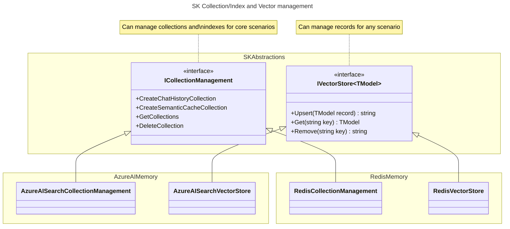
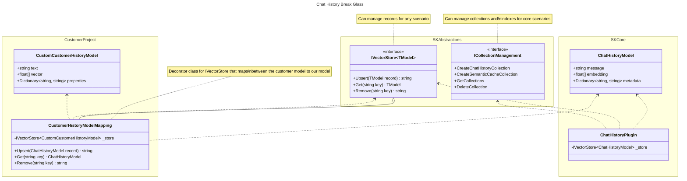
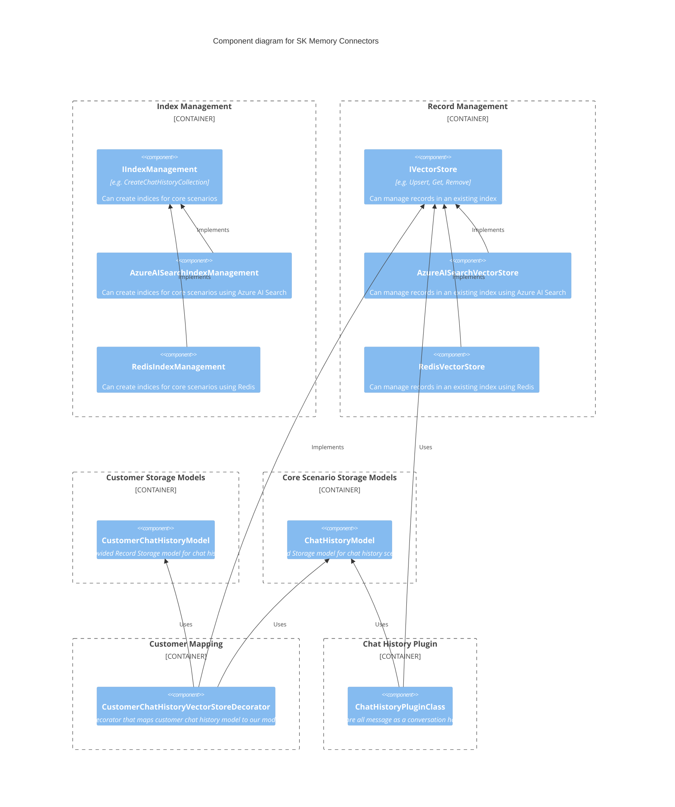

---
# These are optional elements. Feel free to remove any of them.
status: proposed {proposed | rejected | accepted | deprecated | … | superseded by [ADR-0001](0001-madr-architecture-decisions.md)}
contact: westey-m
date: {YYYY-MM-DD when the decision was last updated}
deciders: sergeymenshykh, markwallace, rbarreto, dmytrostruk, westey-m
consulted: {list everyone whose opinions are sought (typically subject-matter experts); and with whom there is a two-way communication}
informed: {list everyone who is kept up-to-date on progress; and with whom there is a one-way communication}
---

# Updated Memory Connected Design

Open Questions:
- How would someone pick a collection, if they are storing the same data across many collections, e.g. partitioned by user.
  - Option 1, add a Collections class where you can get one first and then do crud on it.
  - Option 2, add a collection name parameter to each method, like we have now.
- How do we change the key of a record for azure search before writing without updating the passed in model.
  - This should be done in a decorator, and not in the main class.  If someone really wants this, they can layer it on top, and there can be multiple solutions, e.g. changed passed in model, clone using serialization.
- Current design hides the difference between an index and a collection from users, but they are not always the same thing.
  - In some cases each collection has it's own index.
  - In some cases multiple collections can share an index.







## Context and Problem Statement

Semantic Kernel has a collection of connectors to popular Vector databases e.g. Azure AI Search, Chroma, Milvus, ...
Each Memory connector implements a memory abstraction defined by Semantic Kernel and allows developers to easily intergrate Vector databases into their applications.
The current abstractions are experimental and the purpose of this ADR is to progress the design of the abstractions so that they can graduate to non experimental status.

### Problems with current design

1. The `IMemoryStore` interface has three responsibilities with different cardinalities and levels of significance to Semantic Kernel.
2. The `IMemoryStore` interface only supports a fixed schema for data storage, retrieval and search, which limits it's usefulness to our customers.

Responsibilities:

|Functional Area|Cardinality|Significance to Semantic Kernel|Avaialble alternatives|
|-|-|-|-|
|Collection/Index management|A single instance per store type|Only indirectly useful, when building a store|SDKs for each individual memory store|
|Data Storage and Retrieval|An instance per store type and model|Directly valueable for storing chat history and indirectly valueable in building a store|kernel-memory sdk/service|
|Vector Search|An instance per store type, model and search type|Directly valueable for RAG scenarios|No alternatives since it's a core scenario for Semantic Kernel|


### Memory Store Today
```cs
interface IMemoryStore
{
    // Collection / Index Management
    CreateCollection
    GetCollections
    DoesCollectionExist
    DeleteCollection

    // Data Storage and Retrieval
    Upsert
    UpsertBatch
    Get
    GetBatch
    Remove
    RemoveBatch

    // Vector Search
    GetNearestMatches
}
```

### Actions

1. The `IMemoryStore` should be split into three different interfaces, one for each responsibility.
2. The **Data Storage and Retrieval** and **Vector Search** areas should allow typed access to data and support any schema that is currently available in the customer's data store.
3. The Collection / Index management area should be evolved to support managing common schemas for built in functionality like chat history, and would work with built in models, filters and plugins.
4. Batching should be removed from **Data Storage and Retrieval** since it's primarily there to support bulk load and index operations and this is outside of the scope of SK.
5. Remove opinionated behaviors from connectors. The opinionated behavior limits the ability of these connectors to be used with pre-created vector databases. As far as possible these behaviors should be moved into decorators.  Examples of opinionated behaviors:
    1. The AzureAISearch connector encodes keys before storing and decodes them after retrieval since keys in Azure AI Search supports a limited set of characters.
    2. The AzureAISearch connector sanitizes collection names before using them, since Azure AI Search supports a limited set of characters.
    3. The Redis connector prepends the collection name on to the front of keys before storing records and also registers the collection name as a prefix for records to be indexed by the index.

### Vector Store Cross Store support

|Feature|Azure AI Search|Weaviate|Redis|Chroma|FAISS|Pinecone|LLamaIndex|PostgreSql|
|-|-|-|-|-|-|-|-|-|
|Get Item Suport|Y|Y|Y|Y||Y||Y|
|Batch Operation Support|Y|Y|Y|Y||Y|||
|Per Item Results for Batch Operations|Y|Y|Y|N||N|||
|Keys of upserted records|Y|Y|N<sup>3</sup>|N<sup>3</sup>||N<sup>3</sup>|||
|Keys of removed records|Y||N<sup>3</sup>|N||N|||
|Retrieval field selection for gets|Y||Y<sup>4<sup>|P<sup>2</sup>||N||Y|
|Include/Exclude Embeddings for gets|P<sup>1</sup>|Y|Y<sup>4,1<sup>|Y||N||P<sup>1</sup>|
|Failure reasons when batch partially fails|Y|Y|Y|N||N|||
|Is Key separate from data|N|Y|Y|Y||Y||N|
|Can Generate Ids|N|Y|N|N||Y|||
|Field Differentiation|Key,Props,Vectors|Key,Props,Vectors|Key,Props,Vectors|Key,Text,Metadata,Vectors||Key,Props,Vectors|||
|Index to Collection|1 to 1|1 to 1|1 to many|1 to 1|-|1 to 1|-|1 to 1|

P = Partial Support

<sup>1</sup> Only if you have the schema, to select the appropriate fields.

<sup>2</sup> Supports broad categories of fields only.

<sup>3</sup> Id is required in request, so can be returned if needed.

<sup>4</sup> No strong typed support when specifying field list.

### Support for different storage schemas

The different stores vary in many ways around how data is organized.
- Some just store a record with fields on it, where fields can be a key or a data field or a vector and their type is determined at index creation time.
- Others separate fields by type when interacting with the api, e.g. you have to specify a key explicitly, put metadata into a metadata dictionary and put vectors into a vector array.

This means that we have to know the category of field for each field in the record.
I'm therefore proposing that we use attributes to annotate the model indicating the category of field.

```cs
    [VectorStoreModel]
    public record HotelShortInfo(
        [property: VectorStoreModelKey] string HotelId,
        [property: VectorStoreModelMetadata] string HotelName,
        [property: VectorStoreModelData] string Description,
        [property: VectorStoreModelVector] float[] DescriptionEmbeddings);
```

## Decision Drivers

- Focus on the core value propisition of SK
- Ease of use
- Design for Memory Plugin
- Design must support all Kernel content types
- Design must allow for database specific configuration
- Basic CRUD operations must be supported so that connectors can be used in a polymorphic manner
- Official Database Clients must be used where available
- Dynamic database schema must be supported
- Dependency injection must be supported
- Allow break glass scenarios


## Considered Questions

1. Combined Index and data item management vs separated.
2. Collection name and key value normalization in decorator or main class.
3. Collection name as method param or constructor param.

### Question 1: Combined Index and data item management vs separated.

#### Option 1 - Combined index and data item management

```cs
interface IVectorStore<TDataModel>
{
    Task CreateCollectionAsync(IndexConfig indexConfig, CancellationToken cancellationToken = default);
    Task<IEnumerable<IndexConfig>> GetCollectionsAsync(CancellationToken cancellationToken = default);
    Task DoesCollectionExistAsync(string name, CancellationToken cancellationToken = default);
    Task DeleteCollectionAsync(string name, CancellationToken cancellationToken = default);

    Task UpsertAsync(TDataModel data, CancellationToken cancellationToken = default);
    IAsyncEnumerable<string> UpsertBatchAsync(IEnumerable<TDataModel> dataSet, CancellationToken cancellationToken = default);
    Task<TDataModel> GetAsync(string key, bool withEmbedding = false, CancellationToken cancellationToken = default);
    IAsyncEnumerable<TDataModel> GetBatchAsync(IEnumerable<string> keys, bool withEmbeddings = false, CancellationToken cancellationToken = default);
    Task RemoveAsync(string key, CancellationToken cancellationToken = default);
    Task RemoveBatchAsync(IEnumerable<string> keys, CancellationToken cancellationToken = default);
}

class AzureAISearchVectorStore<TDataModel>(
    Azure.Search.Documents.Indexes.SearchIndexClient client,
    Schema schema): IVectorStore<TDataModel>;

class WeaviateVectorStore<TDataModel>(
    WeaviateClient client,
    Schema schema): IVectorStore<TDataModel>;

class RedisVectorStore<TDataModel>(
    StackExchange.Redis.IDatabase database,
    Schema schema): IVectorStore<TDataModel>;
```

#### Option 2 - Separated index and data item management

```cs

class AzureAISearchCollectionsManager: IVectorCollectionsManager;
class RedisCollectionsManager: IVectorCollectionsManager;
class WeaviateCollectionsManager: IVectorCollectionsManager;

interface IVectorCollectionsManager
{
    Task CreateChatHistoryCollectionAsync(string name, CancellationToken cancellationToken = default);
    Task CreateSemanticCacheCollectionAsync(string name, CancellationToken cancellationToken = default);

    Task<IEnumerable<string>> GetCollectionsAsync(CancellationToken cancellationToken = default);
    Task DoesCollectionExistAsync(string name, CancellationToken cancellationToken = default);
    Task DeleteCollectionAsync(string name, CancellationToken cancellationToken = default);
}

class AzureAISearchVectorStore<TDataModel>(IndexConfig indexConfig): IVectorStore<TDataModel>;

interface IVectorStore<TDataModel>
{
    Task UpsertAsync(TDataModel data, CancellationToken cancellationToken = default);
    IAsyncEnumerable<string> UpsertBatchAsync(IEnumerable<TDataModel> dataSet, CancellationToken cancellationToken = default);
    Task<TDataModel> GetAsync(string key, bool withEmbedding = false, CancellationToken cancellationToken = default);
    IAsyncEnumerable<TDataModel> GetBatchAsync(IEnumerable<string> keys, bool withEmbeddings = false, CancellationToken cancellationToken = default);
    Task RemoveAsync(string key, CancellationToken cancellationToken = default);
    Task RemoveBatchAsync(IEnumerable<string> keys, CancellationToken cancellationToken = default);
}
```

#### Decision Outcome

Chosen option: "Option 2 - Separated index and data item management".

- Index setup and configuration varies considerably across different databases.
- Index setup and configuration outside of some core supported scenarios is not part of the value proposition of SK.


###  Question 2: Collection name and key value normalization in decorator or main class.

#### Option 1 - Normalization in main vector store

```cs
    public class AzureAISearchVectorStore<TDataModel> : IVectorStore<TDataModel>
    {
        ...

        // On input.
        var normalizedIndexName = this.NormalizeIndexName(collectionName);
        var encodedId = AzureAISearchMemoryRecord.EncodeId(key);

        ...

        // On output.
        DecodeId(this.Id)

        ...
    }
```

#### Option 2 - Normalization in decorator

```cs
    new KeyNormalizingAISearchVectorStore<MyModel>(
        "keyField",
         new AzureAISearchVectorStore<MyModel>(...));
```

#### Decision Outcome

Chosen option 2 because this behavior mostly makes sense for scenarios where the vector store is both being written to and read from.
If e.g. the data was written using another tool, it may be unlikely that it was encoded using the same mechanism as supported here
and therefore this functionality may not be appropriate. The developer should have the ability to not use this functionality or
provide their own encoding / decoding behavior.

###  Question 3: Collection name as method param or via constructor

#### Option 1 - Collection name as method param

```cs
public async Task<TDataModel?> GetAsync(string collectionName,  VectorStoreGetDocumentOptions? options = default, CancellationToken cancellationToken = default)
```

#### Option 2 - Collection name via construtor

```cs
public async Task<TDataModel?> GetAsync(string key, VectorStoreGetDocumentOptions? options = default, CancellationToken cancellationToken = default)
```

#### Decision Outcome

Chosen option 1, because we need to support customers / databases who use collections as a partitioning strategy, where e.g. the name may be a user id.

## More Information

{You might want to provide additional evidence/confidence for the decision outcome here and/or
document the team agreement on the decision and/or
define when this decision when and how the decision should be realized and if/when it should be re-visited and/or
how the decision is validated.
Links to other decisions and resources might appear here as well.}
